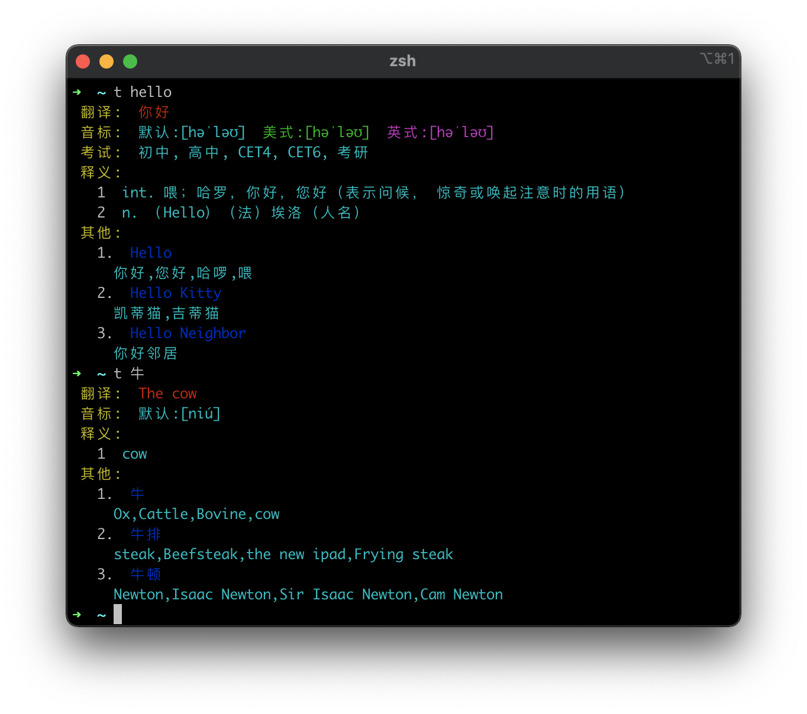
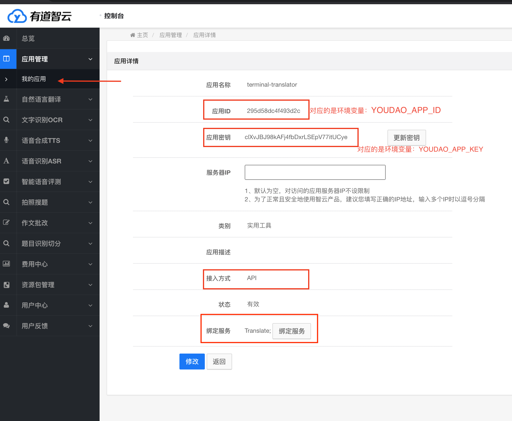

# youdao-baidu-cli-translator

[](https://circleci.com/gh/tsq/youdao-cli-translator/tree/baidu)

一个Node.js命令行工具，用于实现中英互译! 

**该版本在原有的有道翻译的基础上，增加了百度翻译API，用于支持长句子的翻译**，使用前需要额外添加`BAIDU_APP_ID`和`BAIDU_APP_KEY`这两个环境变量，ID和KEY可以前往百度翻译官网获取： https://api.fanyi.baidu.com 。另外，百度翻译API需要充值，你可以先冲个一块钱用用看。




## 使用须知

该工具的翻译API是基于[有道智云](https://ai.youdao.com/login.s)的文本翻译服务，使用前，你自己需要先在有道智云上新建一个应用(参考该文档的[最后部分](#在有道智云上新建一个应用))，获取到应用的ID和KEY，之后，只要将`YOUDAO_APP_ID`和`YOUDAO_APP_KEY`两个环境变量添加到操作系统中即可。

**对于macOS或Linux** 

可以在`.bashrc`或者`.zshrc`中追加以下两条export语句。

```sh
export YOUDAO_APP_ID=应用的ID
export YOUDAO_APP_KEY=应用的KEY
```

**对于Window**

可以按windows键，在弹出的搜索框中，输入`env`，点击搜索结果中的`Edit the system environment variables`，再点击弹出框底部的`Environment variables`，这时会进入环境变量的编辑对话框，上半部份是当前用户的环境变量，下半部分是所有用户共享的环境变量，这里选择添加到当前用户的环境变量即可，所以点击上半部份的`New`按钮，创建一个新的环境变量。YOUDAO_APP_ID和YOUDAO_APP_KEY这两个环境变量都创建好后，确保点击`Ok`按钮，以便将所有修改都被保留。最后新打开一个`Cmd`的窗口输入`t hello`查看测试结果。

*PS.有道智云会为每位新用户提供100元的免费额度，如果是用于个人日常翻译的话，100元我想可以用一辈子了，我自己用了1年多，目前为止只被扣掉了5毛钱。*

## 安装

```sh
npm i -g youdao-baidu-cli-translator
```

## 使用方法

**使用前，请先确保已经配置好YOUDAO_APP_ID和YOUDAO_APP_KEY这两个环境变量！**

安装之后，会产生一个全局的命令`t`，只需要在`t`后面加上想要翻译的单词即可:

```sh
t hello
t 你好
```

如果是一个句子，需要用引号括起来:

```sh
t 'how are you'
```

## 在有道智云上新建一个应用

1. 打开：https://ai.youdao.com/login.s ，用手机或微信号完成登录。
2. 进入控制台后，在左侧**应用管理**中点击菜单项:**我的应用**
3. 点击“创建应用”。
4. 填写"应用名称"和"接入方式", "接入方式"一定要选择“**API**”。
5. 接着会跳到“应用信息预览”页面，点击“绑定服务”，勾选“**自然语言翻译服务-文本翻译**”。
6. 创建成功后，即可在应用详情中获取到应用的ID和KEY了。


